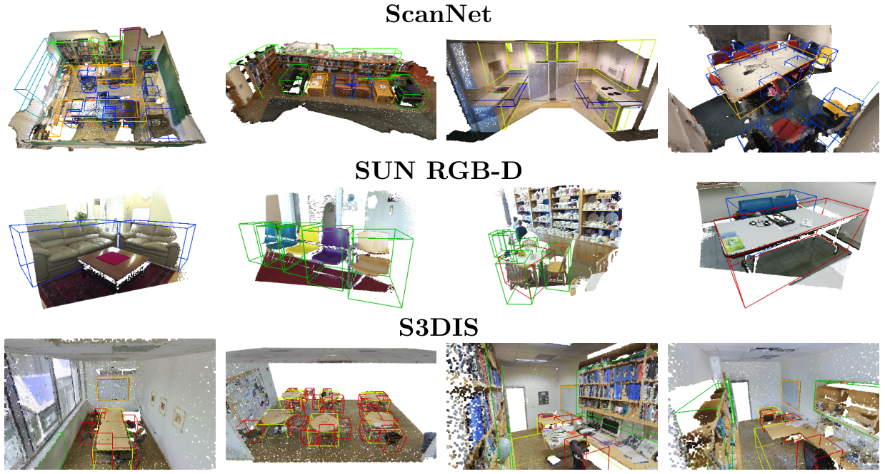

<<<<<<< HEAD
[](https://paperswithcode.com/sota/3d-object-detection-on-scannetv2?p=tr3d-towards-real-time-indoor-3d-object)
[](https://paperswithcode.com/sota/3d-object-detection-on-sun-rgbd-val?p=tr3d-towards-real-time-indoor-3d-object)
[](https://paperswithcode.com/sota/3d-object-detection-on-s3dis?p=tr3d-towards-real-time-indoor-3d-object)

## TR3D: Towards Real-Time Indoor 3D Object Detection

**News**:
 * :fire: June, 2023. TR3D is accepted at [ICIP2023](https://2023.ieeeicip.org/).
 * :rocket: June, 2023. We add ScanNet-pretrained S3DIS model and log significantly pushing forward state-of-the-art.
 * February, 2023. TR3D on all 3 datasets is now supported in [mmdetection3d](https://github.com/open-mmlab/mmdetection3d) as a [project](https://github.com/open-mmlab/mmdetection3d/tree/main/projects/TR3D).
 * :fire: February, 2023. TR3D is now state-of-the-art on [paperswithcode](https://paperswithcode.com) on SUN RGB-D and S3DIS.

This repository contains an implementation of TR3D, a 3D object detection method introduced in our paper:

> **TR3D: Towards Real-Time Indoor 3D Object Detection**<br>
> [Danila Rukhovich](https://github.com/filaPro),
> [Anna Vorontsova](https://github.com/highrut),
> [Anton Konushin](https://scholar.google.com/citations?user=ZT_k-wMAAAAJ)
> <br>
> Samsung Research<br>
> https://arxiv.org/abs/2302.02858

### Installation
For convenience, we provide a [Dockerfile](docker/Dockerfile).

Alternatively, you can install all required packages manually. This implementation is based on [mmdetection3d](https://github.com/open-mmlab/mmdetection3d) framework.
Please refer to the original installation guide [getting_started.md](docs/en/getting_started.md), including MinkowskiEngine installation, replacing `open-mmlab/mmdetection3d` with `samsunglabs/tr3d`.


Most of the `TR3D`-related code locates in the following files: 
[detectors/mink_single_stage.py](mmdet3d/models/detectors/mink_single_stage.py),
[detectors/tr3d_ff.py](mmdet3d/models/detectors/tr3d_ff.py),
[dense_heads/tr3d_head.py](mmdet3d/models/dense_heads/tr3d_head.py),
[necks/tr3d_neck.py](mmdet3d/models/necks/tr3d_neck.py).

### Getting Started

Please see [getting_started.md](docs/getting_started.md) for basic usage examples.
We follow the mmdetection3d data preparation protocol described in [scannet](data/scannet), [sunrgbd](data/sunrgbd), and [s3dis](data/s3dis).

**Training**

To start training, run [train](tools/train.py) with TR3D [configs](configs/tr3d):
```shell
python tools/train.py configs/tr3d/tr3d_scannet-3d-18class.py
```

**Testing**

Test pre-trained model using [test](tools/dist_test.sh) with TR3D [configs](configs/tr3d):
```shell
python tools/test.py configs/tr3d/tr3d_scannet-3d-18class.py \
    work_dirs/tr3d_scannet-3d-18class/latest.pth --eval mAP
```

**Visualization**

Visualizations can be created with [test](tools/test.py) script. 
For better visualizations, you may set `score_thr` in configs to `0.3`:
```shell
python tools/test.py configs/tr3d/tr3d_scannet-3d-18class.py \
    work_dirs/tr3d_scannet-3d-18class/latest.pth --eval mAP --show \
    --show-dir work_dirs/tr3d_scannet-3d-18class
```

### Models

The metrics are obtained in 5 training runs followed by 5 test runs. We report both the best and the average values (the latter are given in round brackets).
Inference speed (scenes per second) is measured on a single NVidia RTX 4090. Please, note that ScanNet-pretrained S3DIS model was actually trained in the original
[openmmlab/mmdetection3d](https://github.com/open-mmlab/mmdetection3d/tree/main/projects/TR3D) codebase.

**TR3D 3D Detection**

| Dataset | mAP@0.25 | mAP@0.5 | Scenes <br> per sec.| Download |
|:-------:|:--------:|:-------:|:-------------------:|:--------:|
| ScanNet | 72.9 (72.0) | 59.3 (57.4) | 23.7 | [model](https://github.com/samsunglabs/tr3d/releases/download/v1.0/tr3d_scannet.pth) &#124; [log](https://github.com/samsunglabs/tr3d/releases/download/v1.0/tr3d_scannet.log.json) &#124; [config](configs/tr3d/tr3d_scannet-3d-18class.py) |
| SUN RGB-D | 67.1 (66.3) | 50.4 (49.6) | 27.5 | [model](https://github.com/samsunglabs/tr3d/releases/download/v1.0/tr3d_sunrgbd.pth) &#124; [log](https://github.com/samsunglabs/tr3d/releases/download/v1.0/tr3d_sunrgbd.log.json) &#124; [config](configs/tr3d/tr3d_sunrgbd-3d-10class.py) |
| S3DIS | 74.5 (72.1) | 51.7 (47.6) | 21.0 | [model](https://github.com/samsunglabs/tr3d/releases/download/v1.0/tr3d_s3dis.pth) &#124; [log](https://github.com/samsunglabs/tr3d/releases/download/v1.0/tr3d_s3dis.log.json) &#124; [config](configs/tr3d/tr3d_s3dis-3d-5class.py) |
| S3DIS <br> ScanNet-pretrained | 75.9 (75.1) | 56.6 (54.8) | 21.0 | [model](https://github.com/samsunglabs/tr3d/releases/download/v1.0/tr3d_scannet-pretrain_s3dis.pth) &#124; [log](https://github.com/samsunglabs/tr3d/releases/download/v1.0/tr3d_scannet-pretrain_s3dis.log) &#124; [config](configs/tr3d/tr3d_scannet-pretrain_s3dis-3d-5class.py) |

**RGB + PC 3D Detection on SUN RGB-D**

| Model | mAP@0.25 | mAP@0.5 | Scenes <br> per sec.| Download |
|:-----:|:--------:|:-------:|:-------------------:|:--------:|
| ImVoteNet | 63.4 | - | 14.8 | [instruction](configs/imvotenet) |
| VoteNet+FF | 64.5 (63.7) | 39.2 (38.1) | - | [model](https://github.com/samsunglabs/tr3d/releases/download/v1.0/votenet_ff_sunrgbd.pth) &#124; [log](https://github.com/samsunglabs/tr3d/releases/download/v1.0/votenet_ff_sunrgbd.log.json) &#124; [config](configs/votenet/votenet-ff_16x8_sunrgbd-3d-10class.py) |
| TR3D+FF | 69.4 (68.7) | 53.4 (52.4) | 17.5 | [model](https://github.com/samsunglabs/tr3d/releases/download/v1.0/tr3d_ff_sunrgbd.pth) &#124; [log](https://github.com/samsunglabs/tr3d/releases/download/v1.0/tr3d_ff_sunrgbd.log.json) &#124; [config](configs/tr3d/tr3d-ff_sunrgbd-3d-10class.py) |

### Example Detections

<p align="center"></p>

### Citation

If you find this work useful for your research, please cite our paper:

```
@misc{rukhovich2023tr3d,
  doi = {10.48550/ARXIV.2302.02858},
  url = {https://arxiv.org/abs/2302.02858},
  author = {Rukhovich, Danila and Vorontsova, Anna and Konushin, Anton},
  title = {TR3D: Towards Real-Time Indoor 3D Object Detection},
  publisher = {arXiv},
  year = {2023}
}
```
=======
# FRESH: Fusion-based 3D apple Recognition via Estimating Stem direction Heading

## Official Pytorch Implementation of [FRESH: Fusion-based 3D apple Recognition via Estimating Stem direction Heading](https://www.mdpi.com/2077-0472/14/12/2161)
#### Authors: [Geonhwa Son](https://sites.google.com/view/geonhwa), [Seunghyeon Lee](https://sites.google.com/view/seunghyeon-lee), [Yukyung Choi](https://scholar.google.com/citations?user=vMrPtrAAAAAJ&hl=ko&oi=sra)


## Abstract
 In 3D apple detection, the challenge of direction for apple stem harvesting for agricultural robotics has not yet been resolved. Addressing the issue of determining the stem direction of apples is essential for the harvesting processes employed by automated robots. 
 This research proposes a 3D apple detection framework to identify stem direction. First, we constructed a dataset for 3D apple detection that considers the 3-axis rotation of apples based on stem direction. Secondly, we designed a 3D detection algorithm that not only 
 recognizes the dimensions and location of apples, as existing methods do, but also predicts their 3-axis rotation. Furthermore, we effectively fused 3D point clouds with 2D images to leverage the geometric data from point clouds and the semantic information from 
 images, enhancing the apple detection performance. Experimental results indicated that our method achieved AP@0.25 89.56% for 3D detection by considering apple rotation, surpassing the existing methods. Moreover, we experimentally validated that the proposed loss 
 function most effectively estimated the rotation among the various approaches we explored. This study shows the effectiveness of 3D apple detection with consideration of rotation, emphasizing its potential for practical application in autonomous robotic systems.
 
> **PDF**: [FRESH: Fusion-based 3D apple Recognition via Estimating Stem direction Heading](https://www.mdpi.com/2077-0472/14/12/2161/pdf)

---

## Usage

## Prerequisites

### Recommended Environment
 * OS : Ubuntu 18.04
 * CUDA : 11.3
 * Python 3.7
 * Pytorch 1.12.1 Torchvision 0.13.1
 * GPU : NVIDA A100 (40G)

### Installation 
1. Install mmcv-full (v1.6.0)
   
   - We used version 1.6.0, but you should check the [documentation](https://mmcv.readthedocs.io/en/v1.7.0/get_started/installation.html) and install it according to the version of CUDA and torch you use.
     
       ```
       pip install mmcv-full==1.6.0 -f https://download.openmmlab.com/mmcv/dist/cu113/torch1.12/index.html
       ```

2. Install mmdet (v0.24.0), mmsegmentation (v0.24.1)
   ```
   pip install mmdet==0.24.0
   pip install mmsegmentation==0.24.1
   ```

3. Clone the FRESHNet repository.
   ```
   git clone https://github.com/sejong-rcv/FRESH.git
   cd mmdetection3d
   pip install -v -e .
   ```

4. Install MinkowskiEngine
   - Users will also need to install Minkowski as the sparse convolution backend. If necessary please Follow the original [installation guide](https://github.com/NVIDIA/MinkowskiEngine#installation):
     
     ```
     apt install build-essential python3-dev libopenblas-dev
     ```
  
     ```
     python3 setup.py install --user --force_cuda --blas=openblas
     ```
   
### Data Preparation
* For convenience, we provide the dataset we reconstructed. You can find them here.
   * [Google Drive](https://drive.google.com/file/d/1ZkcB5bkoV3gpScAgrumJMwrX8zZdPjs4/view?usp=drive_link)
     
~~~~
├── FRESH
   ├── data
      ├── papple_trainval
          ├── calib
          ├── depth
          ├── image
          └── label
~~~~
* Generate dataset info files by running:
  ```
  python tools/create_data.py papple --root-path data/Papple --out-dir data/Papple --extra-tag papple
  ```  

* The directory structure after processing should be as follows.

~~~~
├── FRESH
   ├── data
      ├── papple_trainval
          ├── calib
          ├── depth
          ├── image
          └── label
      ├── points
      ├── papple_infos_train.pkl
      ├── papple_infos_val.pkl
      └── papple_infos_test.pkl
~~~~

* Please note that the parameters provided are the initial parameters before any training has been conducted.
   * ckpt : [Google Drive](https://drive.google.com/file/d/16D612c1CR_NjUE9ZRaYfVkmsXcJ7JBr9/view?usp=drive_link)

* The **checkpoint file**  should be organized as follows:
~~~~
├──  FRESHNet
   ├── ckpt
      ├── log
      ├── log (json)
      ├── config.py
      ├── epoch_10.pth
      ├── epoch_11.pth
      ├── epoch_12.pth
      ├── epoch_13.pth
      ├── epoch_14.pth
      └── epoch_15.pth
~~~~

## Run

### Training
```
bash tools/dist_train.sh configs/freshnet/fresh-ff_stem_direction.py 4 --work-dir work_dirs/
```

### Inference
```
bash tools/dist_test.sh configs/freshnet/fresh-ff_stem_direction.py work_dirs/ 4 --eval mAP
```
## References
We referenced the repos below for the code.
* [TR3D](https://github.com/SamsungLabs/tr3d.git)
* [3D-Metrics](https://github.com/M-G-A/3D-Metrics.git)


>>>>>>> d635dfb10ae23cea64670b1dc084323aeb06decb
